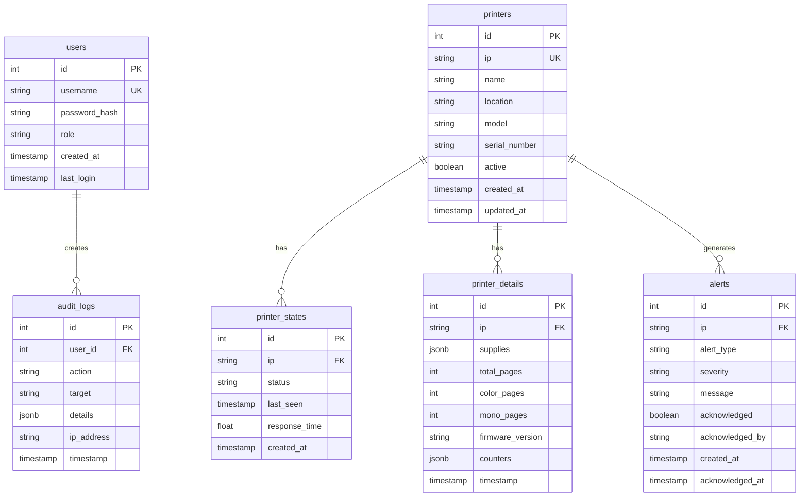

# System Architecture

## Overview
The Smart Printer System (Enterprise Edition) is designed as a distributed, modular application that separates the user interface/business logic from the low-level device monitoring. It employs a traditional client-server architecture backed by a relational database, with an asynchronous background service for device polling.

## High-Level Architecture Diagram
```mermaid
graph TD
    User[User / Admin] -->|HTTPS| WebApp[Flask Web Dashboard]
    
    subgraph "Application Server"
        WebApp -->|Read/Write| DB[(PostgreSQL Database)]
        WebApp -->|Trigger| Anal[Analytics Engine]
        
        Monitor[Monitoring Service] -->|Poll (SNMP/Ping)| Printers[Network Printers]
        Monitor -->|Update Status| DB
        Monitor -->|Send Alerts| SMTP[SMTP / Email Server]
    end
    
    Anal -->|Read History| DB
    Anal -->|Generate Insights| WebApp
```

## Core Components

### 1. Web Application (`dashboard.py`)
*   **Framework**: Flask (Python)
*   **Role**: Serves the UI, handles user authentication, and provides reporting/management capabilities.
*   **Key Modules**:
    *   **Auth Manager**: Handles RBAC (Admin, Technician, Auditor) using `Flask-Login`.
    *   **Report Generator**: Uses `ReportLab` and `CSV` modules to generate downloadable compliance reports.
    *   **Visualizer**: Generates charts using `Matplotlib` (headless mode) for executive summaries.
    *   **Analytics Engine**: Analyzes historical data to predict supply depletion and maintenance events.

### 2. Monitoring Service (`monitor.py`)
*   **Execution**: Runs as a daemon/background thread or independent process.
*   **Role**: Continuously polls registered printers to ensure uptime and data accuracy.
*   **Protocols**:
    *   **SNMP (v1/v2c)**: Used to fetch granular details like toner levels, page counts, model info, and serial numbers.
    *   **ICMP (Ping)**: Used for rapid availability checks (Online/Offline status).
*   **Concurrency**: Uses `concurrent.futures.ThreadPoolExecutor` to poll multiple devices in parallel, ensuring scalability.

### 3. Database Layer (PostgreSQL)
*   **Role**: Central source of truth.
*   **Schema**:
    *   `users`: Stores credentials and role definitions.
    *   `printers`: Registry of managed devices (IP, Name, Location).
    *   `printer_states`: Live status buffer (reduces polling jitter).
    *   `printer_details`: Extended metadata (Supplies, Counters) stored partly as JSONB for flexibility.
    *   `alerts`: History of incidents and acknowledgments.
    *   `audit_logs`: Immutable record of all user actions for compliance.

## Database Schema



### Table Descriptions

#### users
Stores user authentication and authorization data.
- **Roles**: `admin`, `technician`, `auditor`
- **Indexes**: `username` (unique)

#### printers
Registry of all managed printers in the network.
- **Indexes**: `ip` (unique), `active`
- **Relationships**: One-to-many with states, details, and alerts

#### printer_states
Real-time status cache for quick dashboard updates.
- **Purpose**: Reduces database load by caching latest status
- **Indexes**: `ip`, `timestamp`
- **Retention**: Latest status per printer

#### printer_details
Detailed SNMP data and metrics.
- **JSONB Fields**: 
  - `supplies`: Toner, drum, paper levels
  - `counters`: Various printer counters
- **Indexes**: `ip`, `timestamp`
- **Retention**: Configurable (default: 90 days)

#### alerts
Historical record of all alerts and notifications.
- **Alert Types**: `offline`, `low_toner`, `low_paper`, `error`
- **Severity Levels**: `info`, `warning`, `critical`
- **Indexes**: `ip`, `created_at`, `acknowledged`

#### audit_logs
Immutable audit trail for compliance.
- **Actions**: `login`, `logout`, `add_printer`, `delete_printer`, `generate_report`, etc.
- **Indexes**: `user_id`, `timestamp`, `action`
- **Retention**: Permanent (never deleted)

## Data Flow

1.  **Polling Cycle**: 
    *   The `monitor` service wakes up (e.g., every 5 minutes).
    *   It fetches the list of active printers from the DB.
    *   It pings each printer; if online, it queries SNMP OIDs.
    *   Results are written to `printer_states` and `printer_details`.
    *   If a critical threshold is breached (e.g., Toner < 10%), a record is added to `alerts` and an email is dispatched.

2.  **User Interaction**:
    *   A user logs in. The app verifies credentials against `users` table.
    *   The Dashboard queries `printers` joined with `printer_states` to show live status.
    *   Executive reports trigger the `PredictiveAnalyticsEngine` to scan `printer_details` history and calculate ROI/usage trends.

## API Endpoints

### Authentication
- `POST /login` - User authentication
- `POST /logout` - End user session

### Printers
- `GET /` - Dashboard (list all printers)
- `POST /add_printer` - Add new printer
- `POST /delete_printer/<id>` - Remove printer
- `POST /edit_printer/<id>` - Update printer details

### Reports
- `GET /reports` - Report generation page
- `POST /generate_report` - Generate printer report (PDF/CSV)
- `POST /generate_executive_report` - Generate executive summary (PDF/CSV)

### Analytics
- `GET /analytics` - Analytics dashboard
- `GET /api/printer_status/<ip>` - Get real-time printer status (JSON)
- `GET /api/alerts` - Get recent alerts (JSON)

### Administration
- `GET /audit_logs` - View audit trail (admin only)
- `POST /acknowledge_alert/<id>` - Acknowledge alert
- `GET /settings` - System settings (admin only)

## Security Architecture

*   **Authentication**: Session-based auth with `werkzeug` password hashing.
*   **Authorization**: Decorator-based permission checks (`@admin_required`, `@technician_required`) ensure users only access appropriate features.
*   **Network Security**:
    *   SNMP requests are read-only (public community string).
    *   Database connection uses standard authentication.
    *   CSRF protection on all mutating web requests.
    *   Audit logging ensures accountability.
    *   Rate limiting prevents brute-force attacks.

## Performance Considerations

### Scalability Limits
- **Small deployment (1-50 printers)**: Single server, 2 CPU cores, 4GB RAM
- **Medium deployment (51-200 printers)**: Single server, 4 CPU cores, 8GB RAM
- **Large deployment (201-500 printers)**: Dedicated server, 8 CPU cores, 16GB RAM
- **Enterprise deployment (500+ printers)**: Multiple monitoring nodes, database replication

### Optimization Strategies
1. **Database Indexing**: Indexes on frequently queried columns
2. **Connection Pooling**: Reuse database connections
3. **Caching**: Analytics results cached for 1 hour
4. **Concurrent Polling**: ThreadPoolExecutor for parallel SNMP queries
5. **Data Retention**: Automatic cleanup of old printer_details records

### Monitoring Intervals
- **Default**: 5 minutes (300 seconds)
- **Recommended for large fleets**: 10-15 minutes
- **Minimum**: 1 minute (not recommended for production)

## Deployment Architectures

### Single Server (Recommended for <200 printers)
```
[Web Dashboard + Monitor] --> [PostgreSQL] --> [Printers]
```

### Distributed (Recommended for 200+ printers)
```
[Web Dashboard] --> [PostgreSQL] <-- [Monitor Node 1] --> [Printers 1-100]
                                  <-- [Monitor Node 2] --> [Printers 101-200]
                                  <-- [Monitor Node N] --> [Printers N...]
```

### High Availability
```
[Load Balancer] --> [Dashboard 1] --> [PostgreSQL Primary]
                --> [Dashboard 2]     [PostgreSQL Replica]
                
[Monitor Nodes] --> [PostgreSQL Primary]
```

---

For deployment instructions, see [DEPLOYMENT.md](DEPLOYMENT.md).
For troubleshooting, see [TROUBLESHOOTING.md](TROUBLESHOOTING.md).

